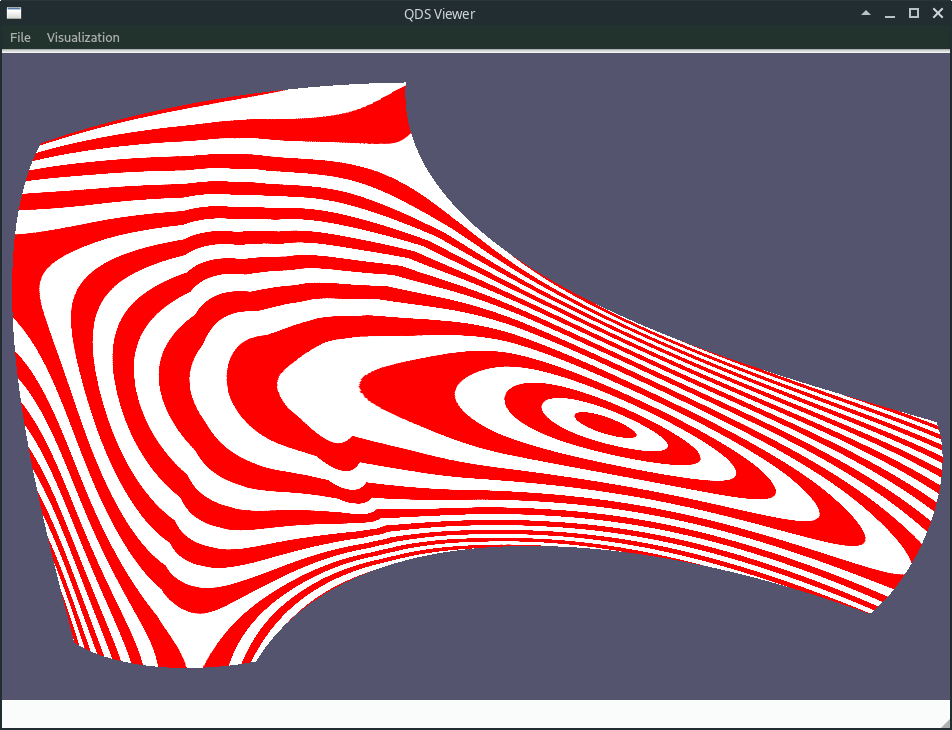
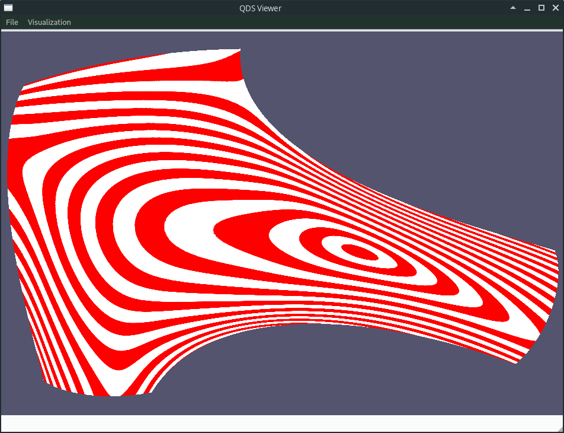
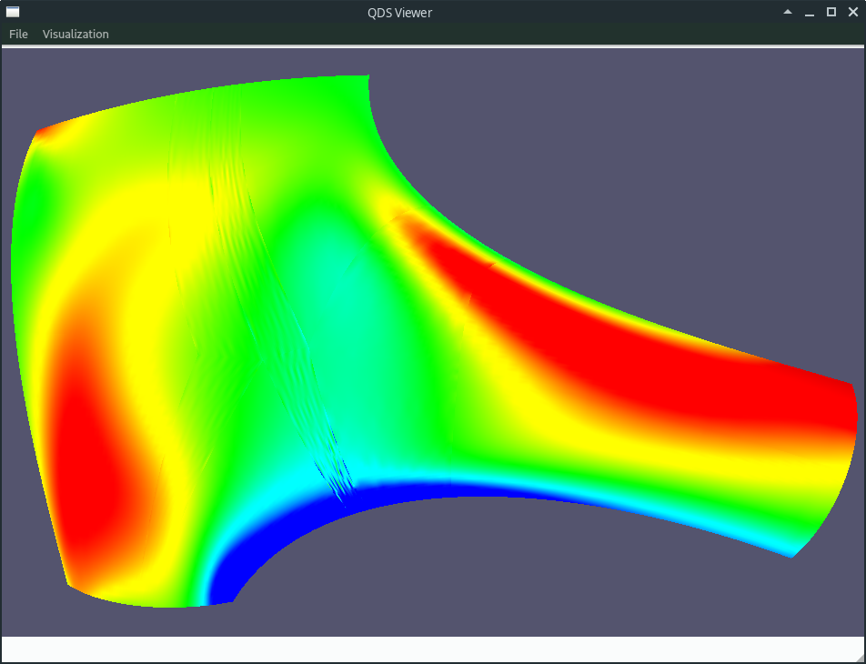
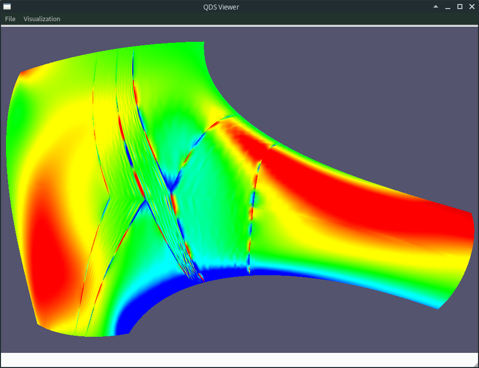
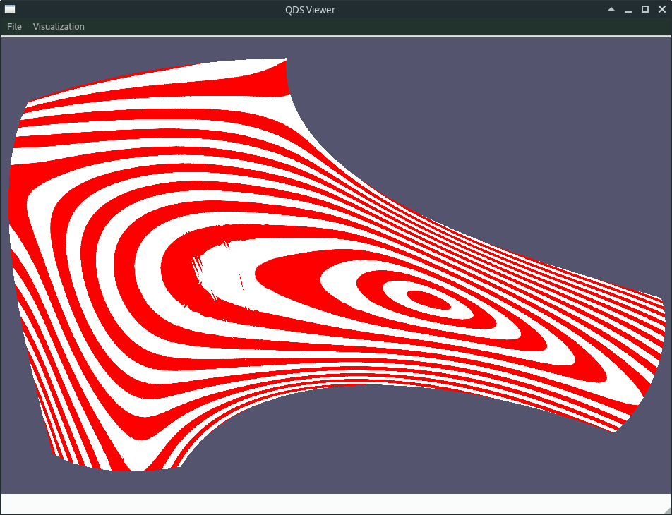

# Experiments

All of the experiments below are executed on a 6-sided patch with polynomial boundaries. (General B-spline boundaries have more complications because of small knot intervals etc., which would just obfuscate the results.)

About the data:
- the underlying GBS surface mesh has resolution 400/200
- the PWGB file has resolution 30 or 100; latter is called HD (`test-hd.pwgb`) below

About the results:
- isophotes and Gaussian curvatures are computed exactly based on the B-spline quads
  (generated by [QDSViewer](https://github.com/salvipeter/qds-viewer))
- continuity between the patches is checked by a dense sample
- continuity error is the C0/G1 deviation between subpatches
- interpolation error is the max. C0/G1 deviation to the ribbons
- approximation error is the max. C0/G1 deviation to the points/normals sampled from the GBS surface
- C0 errors are absolute (the model bounding box has a diagonal of ~200 units)
- G1 errors show the angle between the normal vectors (in degrees)
- Gaussian curvature is scaled into the +/- 3e-5 range

## Experiment 1: G1 Coons patches without approximation

Quad boundaries are created solely by the jet-fitted surface curvatures and the tangent directions at the endpoints (and of course the ribbons). The sampled points/normals are not used in any way.

```
./quadfit-test examples/test.pwgb \
  --mesh=examples/test.obj \
  --coons-patch \
  --print-continuity-errors \
  --print-approximation-errors
```


| Error type         | Value   |
|--------------------|---------|
| Continuity (C0)    | perfect |
| Continutiy (G1)    | perfect |
| Interpolation (C0) | perfect |
| Interpolation (G1) | perfect |
| Approximation (C0) | 0.879   |
| Approximation (G1) | 3.292   |

Conclusions:
- numerically everything works as expected
- the patches do not approximate well the GBS (but it is only a guiding surface here)
- there are large G2 errors

### Experiment 1(b): Pre-fitting first derivatives and twists

The only change is that we now take the first derivatives and twists are taken from a preliminary cubic fit with 16 segments in both directions (for each quad).

```
./quadfit-test examples/test.pwgb \
  --mesh=examples/test.obj \
  --preliminary-fit-tangents \
  --preliminary-fit-twists \
  --coons-patch \
  --print-continuity-errors \
  --print-approximation-errors
```



| Error type         | Value   |
|--------------------|---------|
| Continuity (C0)    | perfect |
| Continutiy (G1)    | perfect |
| Interpolation (C0) | perfect |
| Interpolation (G1) | perfect |
| Approximation (C0) | 0.536   |
| Approximation (G1) | 2.109   |

Conclusions:
- this helps the approximation, but it is still far from adequate
- it seems to harm patch quality

## Experiment 2: C0 cubic fit

Simple cubic least squares fit with either 5 or 13 inner knots (i.e., 6 or 14 segments). The latter is the minimum number of knots to achieve < 0.1 degree interpolation. The two results are visually the same.

```
./quadfit-test examples/test.pwgb \
  --mesh=examples/test.obj \
  --cubic-fit=5 \
  --fix-c0-inside \
  --fix-c0-outside \
  --print-continuity-errors \
  --print-approximation-errors
```




| Error type         | 5 knots | 13 knots |
|--------------------|---------|----------|
| Continuity (C0)    | perfect | perfect  |
| Continutiy (G1)    | 0.042   | 0.068    |
| Interpolation (C0) | perfect | perfect  |
| Interpolation (G1) | 0.278   | 0.094    |
| Approximation (C0) | 0.004   | 0.001    |
| Approximation (G1) | 0.729   | 0.731    |

Conclusions:
- very nice quality
- almost perfect numerical G1 continuity
- Gauss map shows some lines - these are somehow connected to the sampling and mesh resolution (multiple samples from the same triangle?); compare with the HD version below



## Experiment 3: C0 sextic fit with G1 ribbons

Instead of a cubic fit, now we fit with sextic patches so that we can inherit the ribbons. The C2 sextic quad patches have by default 2 segments (1 inner knot of multiplicity 4; 11x11 control points).

```
./quadfit-test examples/test.pwgb \
  --mesh=examples/test.obj \
  --retain-ribbons \
  --fix-c0-inside \
  --print-continuity-errors \
  --print-approximation-errors
```


| Error type         | 1 knot  | 3 knots |
|--------------------|---------|---------|
| Continuity (C0)    | perfect | perfect |
| Continutiy (G1)    | 0.333   | 0.123   |
| Interpolation (C0) | perfect | perfect |
| Interpolation (G1) | perfect | perfect |
| Approximation (C0) | 0.003   | 0.001   |
| Approximation (G1) | 0.756   | 0.733   |

Conclusions:
- continuity between patches not as good as in the cubic case (a small glitch is visible even on the isophote)
- adding 2 more knots (`--extra-knots=1`, 19x19 control points) helps - isophote is perfect, Gauss map is also better:


## Experiment 4: Same with fixed fitted boundaries

(WARNING: This experiment requires some code modification.)

We fit all inner boundaries and fix them before fitting the sextic quads.

In the curve fitting phase, we fix only the endpoints and tangents; the fit uses 3, 5 or 7 inner knots (the latter needs HD samples as it has 35x35 control points).

```
./quadfit-test examples/test.pwgb \
  --mesh=examples/test.obj \
  --preliminary-fit-tangents \
  --extra-knots=1 \
  --fit-curves \
  --retain-boundaries \
  --retain-ribbons \
  --print-continuity-errors \
  --print-approximation-errors
```

(Note that we need the preliminary fit for the first derivatives, otherwise the results are very bad.)




| Error type         | 3 knots | 3 knots (HD) | 5 knots | 5 knots (HD) | 7 knots (HD) |
|--------------------|---------|--------------|---------|--------------|--------------|
| Continuity (C0)    | perfect | perfect      | perfect | perfect      | perfect      |
| Continutiy (G1)    | 3.543   | 4.41         | 2.758   | 4.508        | 4.314        |
| Interpolation (C0) | perfect | perfect      | perfect | perfect      | perfect      |
| Interpolation (G1) | perfect | perfect      | perfect | perfect      | perfect      |
| Approximation (C0) | 0.01    | 0.01         | 0.007   | 0.007        | 0.005        |
| Approximation (G1) | 1.973   | 2.643        | 1.36    | 2.519        | 2.365        |

Conclusions:
- somehow the errors are larger in the HD version (visually there is only minimal change)
- using more knots restricts the artefacts to the vicinity of the inner vertices, e.g. with 7 knots:


These lines are caused by the projection of the second control points onto the tangent plane at the inner vertices. If this projection is omitted (which means that we need to omit the twist correction, as well, but that's OK, since the twists are never used after all), the isophote lines are perfect and the errors are as below:

| Error type         | 3 knots | 5 knots |
|--------------------|---------|---------|
| Continuity (C0)    | perfect | perfect |
| Continutiy (G1)    | 0.594   | 0.67    |
| Interpolation (C0) | perfect | perfect |
| Interpolation (G1) | perfect | perfect |
| Approximation (C0) | 0.007   | 0.002   |
| Approximation (G1) | 0.733   | 0.73    |

Conclusions:
- ???

## Experiment 5: The full suite

This is just for reference. We cannot hope for a good result while the previous experiment gives bad results. The first image is created with 5 inner knots, the second with 7.

```
./quadfit-test examples/test.pwgb \
  --mesh=examples/test.obj \
  --preliminary-fit-tangents \
  --preliminary-fit-twists \
  --extra-knots=2 \
  --fit-curves \
  --fit-normals \
  --retain-direction-blends \
  --print-continuity-errors \
  --print-approximation-errors
```




| Error type         | 5 knots | 7 knots (HD) |
|--------------------|---------|--------------|
| Continuity (C0)    | perfect | perfect      |
| Continutiy (G1)    | perfect | perfect      |
| Interpolation (C0) | perfect | perfect      |
| Interpolation (G1) | perfect | perfect      |
| Approximation (C0) | 0.026   | 0.019        |
| Approximation (G1) | 0.707   | 0.868        |

Conclusions:
- this is not a bad result; if the problem around the extraordinary vertices is fixed, this will be a usable patch
