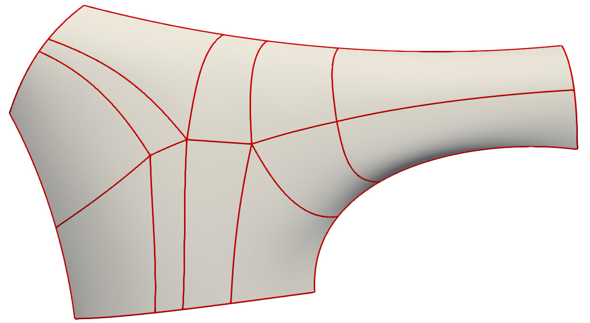

Implementation notes
====================

Dictionary
----------

- ribbon: Two cubic B-spline curves (C1, C2) with the same knot vector
  along the boundary of the patch. C1 represents the boundary, and
  C2 - C1 represents (one-third of) the cross-derivative.
  
- quad: One four-sided region that will be represented by a single
  bi-sextic B-spline surface.
  
- segment: Splines or polylines (linear splines) forming the quad
  boundaries. Between two quads there is only one segment. The
  orientation of the segments are arbitrary.
  
  - boundary segment: A segment that is associated with a ribbon.

  - outer segment: A segment that has exactly one end on a ribbon.
  
  - inner segment: A segment that has no associated ribbon at either end.
  
- vertex: An endpoint of a segment (i.e., a corner vertex of a quad).

  - inner vertex: A vertex that is not on a ribbon.

  - side vertex: A vertex that is on exactly one ribbon.

  - corner vertex: A vertex that is on two ribbons.
  
- local ribbon: A sextic-by-linear B-spline surface representing a
  boundary of a quad.

- tangent control point: The second control point on a quad boundary.

- second derivative control point: The third control point on a quad
  boundary.

- twist control point: The second control point on the second control
  row of a quad.

Workflow
--------

After reading the PWGB file, a simple topology database is built for
efficient queries, and surface normals and principal curvatures &
directions are fitted at the inner vertices with CGAL jet fitting,
using the supplied sample points.

1. Create an initial fit on all quads. This is a simple bicubic Bézier
   surface interpolating the vertices and the tangents of the segments
   (tangent control points are placed using the 1/3 rule). Twists are
   set up using the parallelogram rule.

1. Local ribbons are created along the boundaries by multiplying the
   associated part of the ribbon with a scaling function. This scaling
   function is computed globally along the whole length of the ribbon,
   interpolating the given h-values at the junctions. The local
   ribbons are normalized to the [0,1] interval.

1. Tangent control points of the cubic patches are updated. Tangents
   at corner and side vertices are taken from the associated
   ribbons. Tangents at inner vertices are projected into the normal
   plane (from jet fitting).

1. The twist control points of the cubic patches are updated to
   reflect those of the corresponding ribbons, where applicable.
   Where there is no adjacent ribbon, the twist control points are
   computed as the quasi-intersection of lines going through the
   adjacent fixed control points.

1. The cubic patches are degree elevated to quintic, and then the
   second derivative control points are updated. At the ends of
   boundary segments these are not needed (we already know the local
   ribbons there, and the twists control points can also be directly
   computed from these); at the ribbon-end of outer segments no change
   is made (!); and all other second derivative control points are
   projected onto a plane that has its height constrained by the
   principal curvatures.
   
1. The twist control points at inner vertices are updated: we project
   the twist control point onto a plane that has its height
   constrained by the principal curvatures.

1. Compute the local ribbons at both outer and inner segments. First a
   quartic, two-segment B-spline boundary curve is created from the
   already fixed boundary information (end CP, tangent CP, 2nd
   deriv. CP). Similarly, on both sides of the segment, a cubic,
   one-segment B-spline curve is fit on the second control row (cross
   derivatives and twists), into which the same inner knot is inserted
   (at present this is always 0.5).
   
   *(TODO: Here we should approximate the boundary and the normals.)*
   
   Next, a direction blend is defined by taking the mean of the
   cross-derivatives, and a common local ribbon surface is created
   that interpolates the boundary, the cross-derivatives at the ends,
   and the twists.
   
1. The quintic patches are degree-elevated to sextic. For each quad,
   the knot vectors of opposite local ribbons are unified; all inner
   knots are also inserted into the sextic surface. Then the control
   points of the sextic ribbons are copied into the sextic patch.
   
1. *(TODO: Here we should approximate the sampled points with the
   remaining free control points.)*
